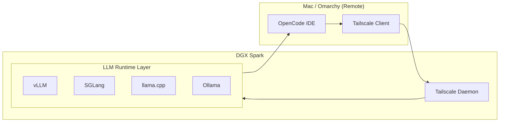
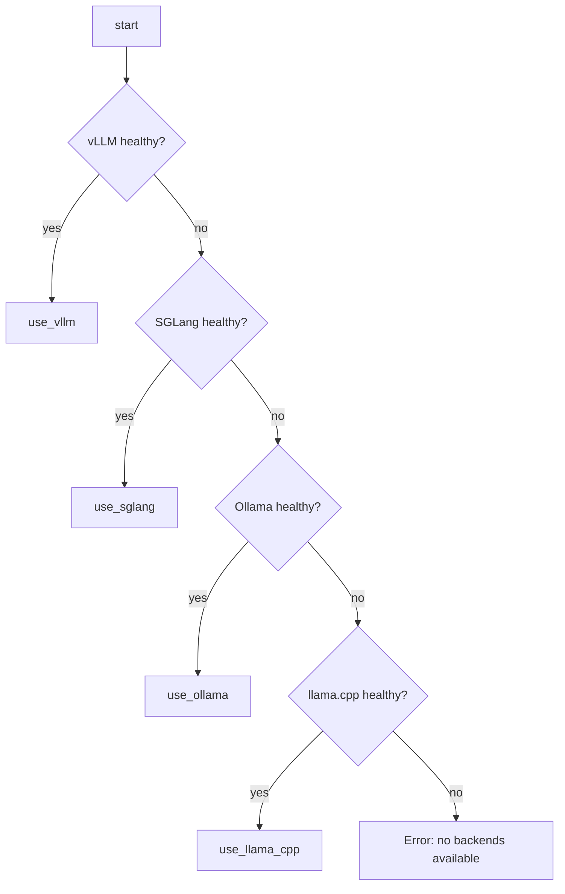

# futureboytech-dgx-stack


A complete, production-grade DGX Spark local LLM development stack integrating:
- vLLM (DeepSeek-R1-Distill-Qwen-14B)
- SGLang (Qwen2.5-14B-Instruct)
- llama.cpp (Kimi-K2-Thinking-80B)
- Ollama (llama3.1 GPU)
- OpenCode custom tools + router
- Tailscale secure networking
- Systemd-managed GPU inference servers
- CI + Release automation

## Architecture



## Router Logic



## Systemd Startup Chain

```
network-online.target
    |
    +--> vllm.service
    +--> sglang.service
    +--> llama_cpp.service
    +--> ollama.service
```

## Installation Overview

1. Run setup on DGX:
```
./setup_dgx_stack.sh dgx
```

2. Capture DGX Tailscale IP.

3. Run on Mac + Omarchy:
```
./setup_dgx_stack.sh mac
./setup_dgx_stack.sh omarchy
```

4. Edit `~/.ssh/config` HostName for `dgx`.

5. Connect:
```
dgx-connect
curl http://localhost:8000/v1/models
```

## LLM Runtime Summary

- vLLM → DeepSeek R1 Distill 14B  
- SGLang → Qwen2.5 14B  
- llama.cpp → Kimi-K2-Thinking 80B GGUF  
- Ollama → llama3.1 GPU-enabled  

## OpenCode Integration

Tools are defined under `.opencode/tool/`.

Use router:

```
@router {
  "body": {
    "model": "deepseek-r1",
    "messages": [{"role":"user","content":"Hello DGX"}]
  }
}
```

## GPU Dashboard

```
scripts/gpu-dashboard.sh
```

Displays VRAM, GPU load, tokens/sec (vLLM/SGLang).

## CI / CD

CI workflow runs:
- ShellCheck
- Prettier
- YAML lint

Release workflow auto-publishes tagged releases.

## Security

- All remote traffic over Tailscale WireGuard  
- MFA recommended  
- DGX can be restricted via ACL tags  

## Roadmap

- Multi-node routing
- Speculative decoding
- DGX telemetry dashboard
- Auto-update services from releases

## License

MIT License


