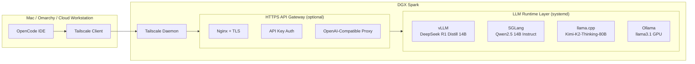
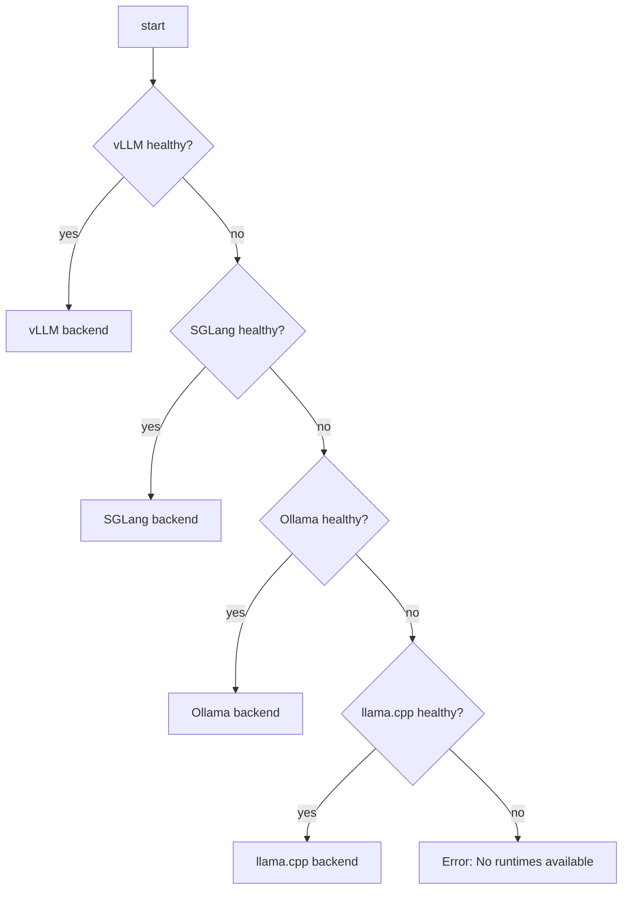

# futureboytech-dgx-stack


---

## 📘 Overview

This repository is a **full production-ready DGX Spark LLM orchestration stack**, including:

- **vLLM** → *deepseek-ai/DeepSeek-R1-Distill-Qwen-14B*
- **SGLang** → *qwen/Qwen2.5-14B-Instruct*
- **llama.cpp** → *Kimi-K2-Thinking-80B.gguf*
- **Ollama** → *llama3.1 (GPU)*
- OpenCode router + custom tools
- Tailscale secure mesh networking
- systemd GPU service management
- CI/CD workflows (ShellCheck, Prettier, yamllint)
- Automated GitHub Release workflows
- Optional HTTPS gateway for Google Antigravity (OpenAI-compatible API)

Your DGX becomes a **private AI cloud** accessible from:

- macOS
- Omarchy / Arch Linux
- Cloud workstations
- OpenCode TUI/CLI/IDE
- Google Antigravity (via gateway)

---

## 🌐 Architecture



---

### 🔀 Router Logic (OpenCode)



---

### 🛠 Systemd Startup Chain

```
network-online.target
  ├── vllm.service
  ├── sglang.service
  ├── llama_cpp.service
  └── ollama.service
```

Each service is responsible for launching a specific runtime:
- **vllm.service** → vLLM server (DeepSeek R1 Distill 14B)
- **sglang.service** → SGLang server (Qwen2.5 14B Instruct)
- **llama_cpp.service** → llama.cpp HTTP server (Kimi-K2 80B GGUF)
- **ollama.service** → Ollama ollama serve (llama3.1)

---

## 🚀 Installation & Setup

### 1. Clone or download

```bash
git clone https://github.com/futureboytech/futureboytech-dgx-stack.git
cd futureboytech-dgx-stack
```

(or use the ZIP you already downloaded and cd into it)

### 2. DGX-side setup (high level)
- Install Docker + NVIDIA Container Toolkit
- Install Tailscale
- Install vLLM, SGLang, llama.cpp, Ollama binaries/images
- Copy `dgx-services/bin/*` into `/opt/dgx_stack` (or similar)
- Install systemd unit files (not included here yet, but script paths match what we discussed)

### 3. Client-side setup (Mac / Omarchy)

Run the setup script (when you drop it into this repo or your dotfiles):

```bash
./setup_dgx_stack.sh mac
./setup_dgx_stack.sh omarchy
```

Then:
- Update `~/.ssh/config` Host dgx to point to DGX’s Tailscale IP
- Open a new shell so the `dgx-connect` alias is loaded

### 4. Connect and verify

From Mac/Omarchy:

```bash
dgx-connect
curl http://localhost:8000/v1/models   # vLLM
curl http://localhost:30000/health     # SGLang
```

---

## 🧠 LLM Runtime Summary

- **vLLM** → `deepseek-ai/DeepSeek-R1-Distill-Qwen-14B`
- **SGLang** → `qwen/Qwen2.5-14B-Instruct`
- **llama.cpp** → `Kimi-K2-Thinking-80B.gguf` loaded via llama.cpp-server
- **Ollama** → `llama3.1` with GPU support

**Ports (by convention):**
- vLLM: 8000
- SGLang: 30000
- llama.cpp: 8080
- Ollama: 11434

---

## 🧩 OpenCode Integration

The `.opencode/` folder is prepared to integrate with OpenCode’s custom tools and router.

From OpenCode, you can call the router:

```json
@router {
  "body": {
    "model": "deepseek-r1",
    "messages": [
      {"role": "user", "content": "Hello DGX, what can you do?"}
    ]
  }
}
```

Or individual backends:
- `@vllm { "body": { ... } }`
- `@sg { "body": { ... } }`
- `@ollama { "prompt": "hi" }`
- `@llama_cpp { "prompt": "hello" }`

(Those tool files can be added to `.opencode/tool/` using the earlier TS examples.)

---

## 📊 GPU Dashboard

Quick live GPU view:

```bash
./scripts/gpu-dashboard.sh
```

Default implementation:

```bash
watch -n1 nvidia-smi
```

You can upgrade this later to a full Prometheus/Grafana stack.

---

## 🩺 Health & Maintenance

Basic health probe:

```bash
./scripts/health-probe.sh
```

Example behavior (assuming you wire it):
- Checks vLLM `/health`
- Checks SGLang `/health`
- Checks llama.cpp `/health`
- Checks Ollama `/api/tags`

Restart all services:

```bash
./scripts/restart-all.sh
```

---

## 🧪 CI/CD

GitHub Actions workflows:
- `.github/workflows/ci.yml`
  - ShellCheck for shell scripts
  - Prettier for any JS/TS in tools
  - yamllint for YAML files
- `.github/workflows/release.yml`
  - Triggered on tags like `v1.0.0`
  - Can be extended to upload Docker images or ZIPs

The badges at the top of this README will reflect status once CI runs.

---

## 📡 Antigravity Gateway (Concept)

To integrate with Google Antigravity, you need:
- An HTTPS endpoint exposing:
  - `GET /v1/models`
  - `POST /v1/chat/completions`
  - OpenAI-compatible JSON
  - Bearer token auth

The recommended pattern:
1. A small FastAPI/Node proxy that:
   - Verifies `Authorization: Bearer <API_KEY>`
   - Forwards `/v1/chat/completions` to DGX vLLM endpoint
   - Responds in OpenAI-compatible format
2. Nginx in front to:
   - Terminate TLS (`https://llm.futureboytech.ai`)
   - Forward `/v1/*` to the gateway container

Then in Antigravity:
- Custom provider:
  - Base URL: `https://llm.futureboytech.ai/v1`
  - API key: `GATEWAY_KEY`
  - Models: `deepseek-r1`, `qwen-14b-instruct`, `kimi-k2-80b`

(We can add the exact gateway code into `antigravity-gateway/` in this repo as a next step.)

---

## 🔐 Security Model

- All remote dev traffic goes over Tailscale WireGuard
- DGX is not exposed directly to the public internet
- For Antigravity / public API, Nginx + TLS + API key sit in front
- You can add Tailscale ACLs and Nginx IP allowlists for stricter control

---

## 🔮 Roadmap Ideas

- Multi-node DGX routing (if you add more nodes)
- Speculative decoding with vLLM
- Integrated monitoring (Prometheus + Grafana)
- Devcontainer for VS Code + Codespaces
- Full Antigravity gateway folder in this repo

---

## 📜 License

This project is licensed under the MIT License.
